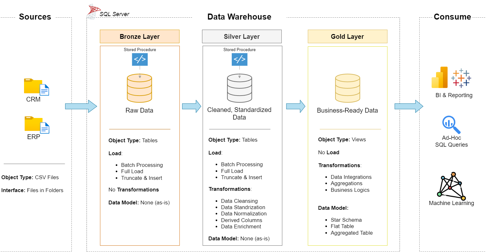

# Data Warehouse & Analytics Project

Welcome to the **Data Warehouse & Analytics Project** repository! 🚀  
This project showcases an end-to-end data warehousing and analytics solution, covering everything from data ingestion and transformation to dimensional modeling and analytical reporting.

Built as a portfolio project, it demonstrates industry-standard data engineering practices, including:

- Scalable data modeling  
- Rigorous data quality validation  
- Dimension and fact table design  
- Analytical querying and reporting  

A core highlight of this implementation is the use of the **Medallion Architecture (Bronze → Silver → Gold)**, enabling a structured, incremental, and reliable data transformation workflow.

This repository provides a practical example of how modern data platforms process raw operational data into high-quality, analytics-ready datasets that drive actionable insights.

----------------

## 🏗️ Data Architecture

The data architecture for this project follows the **Medallion Architecture** consisting of **Bronze**, **Silver**, and **Gold** layers.

### **1. Bronze Layer**
Stores raw data exactly as received from the source systems.  
Data is ingested from **CSV files** into the **SQL Server** database without modification.

### **2. Silver Layer**
Performs **cleaning, standardization, and normalization** to improve data quality  
and ensure consistent structure across all datasets.

### **3. Gold Layer**
Contains **business-ready, analytics-optimized data** modeled into a **star schema**,  
used for reporting, dashboards, and advanced analytics.

----------------------

## 📖 Project Overview

This project showcases the end-to-end development of a modern **Data Warehouse** and analytics ecosystem. It covers the full lifecycle of data engineering, from ingestion to business-ready insights.

### 🔧 Key Components

- **Data Architecture:** Implementation of the **Medallion Architecture** (Bronze → Silver → Gold) to ensure structured, scalable, and high-quality data processing.
- **ETL Pipelines:** Extraction, transformation, and loading of data from CSV sources into a SQL Server–based warehouse.
- **Data Modeling:** Design of optimized **dimensional models** (fact and dimension tables) suitable for analytical workloads.
- **Analytics & Reporting:** Creation of SQL-driven analyses and dashboards that deliver meaningful business insights.

### 🎯 Who This Project Is For

This repository is designed as a strong portfolio piece, showcasing **my data engineering skills for job opportunities** and providing value to professionals and learners interested in:

- **SQL Development**
- **Data Architecture**
- **Data Engineering**
- **ETL Pipeline Development**
- **Data Modeling**
- **Data Analytics**

It serves as a practical, industry-aligned demonstration of how modern data platforms transform raw data into reliable, analytics-ready insights.

